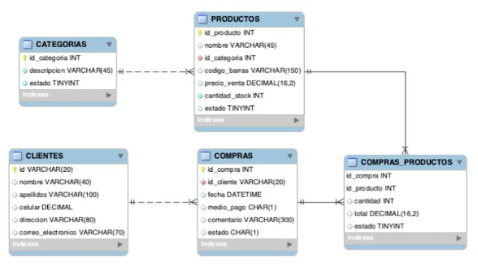

# Spring Boot

* [captura de apuntes](https://docs.google.com/document/d/1whzY5DwcKjnMf2dsteM3sRMzqClnMa-p1IHvUeYaE94/edit)
* [Drive](https://drive.google.com/drive/u/2/folders/1Clc8eVCVBgdpDvaUh8ScybhTWufs8jzd)

## JPA

#### Java Persistence Api

JPA es una especificación de Java, standar, para un framework ORM. Quiere decir que son uan serie de reglas que Java
define para que cualquier framework que quierea interactura con la BD de Java, tenga que seguir.

Los frameworks mas populares de Java para este fin son:

* Hibernate
* TopLink
* EclipseLink
* ObjectDB

### Anotaciones JPA

JPA utiliza anotaciones para conectar clases a tablas de la BD y asi evitar hacerlo de manera nativa con SQL.

* `@Id` Atributo de clave primaria sencilla.
* `@Entity` Indica a una clase de java que esta representando una tabla de nuestra BD.
* `@Table`  Recibe el nombre de la tabla a la cual esta mapeando la clase.
* `@Column`  Se le pone a los atributos de la clase, no es obligatoria, se indica sólo cuando el nombre de la columna es
  diferente al nombre del atributo de la tabla.
* `@GeneratedValue`  Permite generar automáticamente generar valores para las clases primarias en nuestras clases
* `@Embeddable` & `@EmbededID` Clave primaria compuesta.
* `@OneToMany` and `@ManyToOne` Representar relaciones

```java

@Id
@GeneratedValue(strategy = GenerationType.IDENTITY)
@Column(name = "id_producto")
private Integer idProducto;
```

### Clave Primaria Compuesta

Se debe crear una clase aparte que tenga los atributos de la llave compuesta

* `@Embeddable` Va dentro de la clase que se creó con los atributos de la llave compuesta

```java

@Embeddable
public class ComprasProductoPK implements Serializable {
    @Column(name = "id_compra")
    private Integer idCompra;

    @Column(name = "id_producto")
    private Integer idProducto;
}
```

> Solo los tipos que pueden ser embebidos necesitan implementar explícitamente la interface Serializable. Hibernate (la
> implementación de JPA que usa Spring Data) requiere que esto sea así cuando se usa luego con @Embeddable.
> Esto debido que el id (el objeto completo) será usado como llave para indexar los objetos en la sesión y por lo tanto
> necesita estar serializado para no obtener un error de casteo.

* `@EmbededID` Clave primaria compuesta. Va dentro de la clase principal que usa a la clase creada

```java

@Entity
@Table(name = "compras_productos")
public class ComprasProducto {
    @EmbeddedId
    private ComprasProductoPK id;
}
```

### Interfaz serializable

Cuando implementas la interface Serializable estás brindándole a un objeto de esa clase la capacidad de ser convertido
en un flujo de bytes para guardar en disco o ser enviado a través de la red.
El proceso de deserialización hace lo contrario.


Dejando esto claro podemos entonces hablar del serialVersionUID. Esta constante se define para que durante la
deserialización se verifique que el remitente (quien serializa) y el receptor (quien deserializa) están usando clases
compatibles para ese objeto. En caso de que el serialVersionUID no coincida se obtiene el error InvalidClassException.

Más que marcarte un error te marca una advertencia. Puedes compilar tu programa sin errores aun sin usar el
serialVersionUID. Sí no se define uno entonces se definirá automáticamente un valor predeterminado en tiempo de
ejecución teniendo en cuenta varios factores.

Te dejo este articulo de DZone donde explican varios detalles interesantes del
[serialVersionUID](https://dzone.com/articles/what-is-serialversionuid).

## MER Proyecto



## Relaciones OneToMany - ManyToOne

```java
    @ManyToOne
    @JoinColumn(name = "id_cliente", insertable = false, updatable = false)
    private Cliente cliente;

    @OneToMany(mappedBy = "compra")
    private List<ComprasProducto> productos;

```

## Perfiles Sring Boot

* Archivo **resources/application.properties**
* facilita la getión de perfiles, se debe seguir la convención de nomenclatura (-dev, -prd)
    * application-dev.properties
    * application-prd.properties
* Hay que indicar que perfil está activo en el archivo principal

```gradle
spring.profiles.active=dev
spring.application.name=spring-market
server.servlet.context-path=/belos-market/api
spring.datasource.driverClassName=org.postgresql.Driver
```

> añade variables y atributos para la configuración

## Spring Data

> Es como un **ORM**

* Spring Data NO es una implementacion de JPA, sino mas bien es un proyecto que usa JPA para ofrecer funcionalidaes
  extra en la gestion de tareas desde JAVA a las base de datos.
* Ofrece un nivel de abstracción para no tener que trabajar con la particularidad de cada motor,
* Evita el código repetitivo tipo CRUD

Spring Data internamente tiene varios subproyectos, entre ellos: Spring Data JPA y Spring Data JDBC, para conectarnos a
BD relacionales (SQL). Spring Data MongoDB y Spring Data Cassandra, son proyectos para conectarnos a BD no relacionales.

La tarea principal de Spring Data es optimizar tareas repitivas.

Spring data nos provee de respositorios sin codigo, nos permiten hacer todo tipo de operaciones en BD (CRUD) sin
utilizar una linea de código.

También nos provee de auditorías transparentes, por ello, posee un motor de auditorias que nos permite saber cuadno se
insertó un registro, cuando se borró, cuando se actualizo en la BD, etc.

### Implementación Spring Data en el proyecto Market:

Se busca en [MAVEN REPOSTITORY](https://mvnrepository.com/) el
repositorio [Spring Boot Starter Data JPA](https://mvnrepository.com/artifact/org.springframework.boot/spring-boot-starter-data-jpa),
se copia el group y el name dentro del tag `dependencies` del archivo **build.gradle**
de nuestro proyecto quedando de la siguiente manera.

```gradle
dependencies { 
    implementation 'org.springframework.boot:spring-boot-starter-data-jpa'
    ...
    }
```

## Pasos Conexion DB - Repositorio

#### SECUENCIAS

```sql
-- Repaso postgresql

"id_categoria" SERIAL NOT NULL, ...
...
SELECT setval('public.productos_id_producto_seq', 50, true);
```

> * el tipo *SERIAL* crea una secuencia en postgres
> * y esa secuencia se puede reiniciar con otro valor

### 1. build.gradle

Se busca en [MAVEN REPOSTITORY](https://mvnrepository.com/) el
repositorio [postgresql](https://mvnrepository.com/artifact/org.postgresql/postgresql),
se copia el group y el name dentro del tag `dependencies` del archivo **build.gradle**
de nuestro proyecto quedando de la siguiente manera.

```gradle
dependencies { 
    implementation ...
    runtimeOnly 'org.postgresql:postgresql'
    ...
    }
```

### 2. src/main/resources/application.properties

Es buena practica declarar el driver de postgresql en este archivo:

```gradle
spring.datasource.driverClassName=org.postgresql.Driver
```

> esta es la versión moderna de declararlo

### 3. src/main/resources/application-dev.properties

se añaden las configuraciones de conexión en **application-dev** y **application-prd**:

```gradle
# Database
spring.datasource.url=jdbc:postgresql://localhost:5432/spring-market
spring.datasource.username=postgres
spring.datasource.password=1234
```

### Con MySql

```gradle
implementation 'mysql:mysql-connector-java'
```

```gradle
spring.datasource.url=jdbc:mysql://localhost/java?serverTimezone=UTC
spring.datasource.username=root
spring.datasource.password=
spring.datasource.driver-class-name=com.mysql.cj.jdbc.Driver
```
